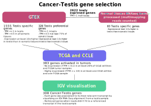

```{r style, echo = FALSE, results = 'asis'}
BiocStyle::markdown()
```

# Introduction

The `CTexploreR` package re-defines the list of Cancer Testis (CT) genes (also 
known a Cancer Germline genes) based on publicly available RNAseq databases 
(GTEx, CCLE and TCGA) and summarises their main characteristics. Several 
visualisation functions allow to explore their expression in different types of 
tissues and cancer cells, or to inspect the methylation status of their 
promoters in normal tissues.

It has appeared while working on CT genes that there was no reliable database. 
One existing database, CTdatabase (2009) showed different issues : problematic 
gene names, no precise chromosomal location, expression profiles based on old 
methods (no RNAseq data), no data about DNA methylation, missing genes identified
recently and not in an importable format. 

Another known database is the one from Wang's team (2016), however there are 
other caveats : just a list of genes in  supplemental data, selection criteria 
are not at all stringent, based on RPKM values, multi-mapping problem is not 
addressed and no individual data about promoter DNA methylation. 

We thus decided to create a new CT gene resource satisfying all of our needs 
for the analysis of CT genes. We provide a list of 307 CT genes, see table below, 
selected based on their expression in normal and tumoral tissues (selection 
details in the next section). Information about gene location, expression in 
normal tissues, expression in tumor sample and cell lines, methylation of 
promoter can also be found in the table. 

```{r CT_genes}
library(CTexploreR)
CT_genes
```


`CTdata` is the companion Package for `CTexploreR` and provides the omics
data that was necessary to select and characterise cancer testis genes as well 
as exploring them. Data come from public databases and include expression and 
methylation values of genes in normal and tumor samples as well as in tumor cell
lines, and expression in cells treated with a demethylating agent is also
available. The data are served through the `ExperimentHub` infrastructure. 
Currently available data are summarised in the table below and details can be 
found in `CTdata` vignette or manuals.

```{r data}
CTdata()
```


# Installation

To install the package:

```{r install1, eval = FALSE}
if (!require("BiocManager"))
    install.packages("CTexploreR")

BiocManager::install("CTexploreR")
```

To install the package from GitHub:

```{r install2, eval = FALSE}
if (!require("BiocManager"))
    install.packages("BiocManager")

BiocManager::install("UCLouvain-CBIO/CTexploreR")
```

# CT gene selection

In order to generate the list of CT genes, we followed an specific selection 
(see figure below).

```{r, echo=FALSE, fig.align='center', out.width = '100%'}

```

## Testis-specific expression

Testis-specific genes (expressed exclusively in testis) and testis-preferential 
genes (expressed in a few somatic tissues at a level lower than 10x testis 
expression) were first selected using GTEx database.

Note that some genes were undetectable in GTEx database due to multimapping 
issues (these were flagged as "lowly expressed" in `GTEX_category` column). 
A careful inspection of these genes showed that many of them are well-known 
Cancer-Testis genes, belonging to gene families (MAGEA, SSX, CT45A, GAGE, …) 
from which members have identical or nearly identical sequences. This is likely 
the reason why these genes are not detected in GTEx database, as GTEX processing
pipeline specifies that overlapping intervals between genes are excluded from 
all genes for counting.

For these genes, as testis-specificity could not be assessed using GTEx database,
RNAseq data from a set of normal tissues were home-processed in order to allow 
multimapping. Expression of several genes became detectable in some tissues. 
Genes showing a testis-specific expression (expression at least 10x higher in 
testis than in any somatic tissues when multimapping was allowed) were selected, 
and flagged as testis-specific in `multimapping_analysis` column.


## Activation in cancer cell lines and TCGA tumors

RNAseq data from cancer cell lines from CCLE were used to select among 
testis-specific and testis-prefential genes those that are activated in cancers.
In the `CCLE_category` column, genes are tagged as "activated" when they are 
highly expressed in at least one cancer cell line (TPM >= 10). However genes that 
were found to be expressed in all -or almost all- cancer cell lines were removed,
as this probably reflects a constitutive expression rather than a true 
activation. We filtered out genes that were not completely repressed in at 
least 20 % of cell lines (TPM <= 0.1).

RNAseq data from TCGA cancer samples were used to select among testis-specific 
and testis-prefential genes those that are activated in cancers. In the 
`TCGA_category` column, genes are tagged as "activated" when they are highly 
expressed in at least one cancer sample (TPM >= 10). But genes that were found 
to be expressed in all -or almost all- cancer samples were removed, as this 
probably reflects a constitutive expression rather than a true activation. We 
filtered out genes that were not completely repressed in at least 20 % of cancer
samples (TPM <= 0.1).


## IGV visualisation

All selected CT genes were visualised on IGV using a RNA-seq alignment from 
testis, to ensure that expression in testis really corresponded to the canonical
transcript. For some genes for which the canonical transcript did not correspond
to the transcript that we could see in the testis sample, we manually modified  
the `external_transcript_name` accordingly, to ensure that the TSS and the 
promoter region are correctly defined. This is particularly important for 
methylation analysis that must be focused on true promoter regions.

## Regulation by methylation

Genes flagged as `TRUE` in `regulated_by_methylation` column correspond to

* Genes that are significantly induced by a demethylating agent (RNAseq analysis
of cell lines reated with DAC (5-Aza-2′-Deoxycytidine)).

* Genes that have a highly methylated promoter in normal somatic tissues but 
less methylated in germ cells (WGBS analysis of a set of normal tissues).

For some genes showing a strong activation in cells treated with 
5-Aza-2′-Deoxycytidine, methylation analysis was not possible due to multimapping
issues. In this case, genes were still considered as regulated by methylation 
unless their promoter appeared unmethylated in somatic tissues or methylated in 
germ cells.


# Available functions

For details about functions, see their respective manual pages. For all functions,
an option `return` can  be set to `TRUE` in order to get the values instead of the
visualisation.


## Expression in normal tissues

### `GTEX_expression()`

Allows to visualise gene expression in GTEx tissues. We can for example see the 
difference of expression between testis-specific and testis-preferential genes.

* Applied to testis-specific genes : we can clearly see the expression only in 
testis as well as genes lowly expressed in GTEx.

```{r}
testis_specific <- dplyr::filter(CT_genes, testis_specificity == "testis_specific")
GTEX_expression(testis_specific$external_gene_name, units = "log_TPM")
```

* Applied to testis-preferential genes : we can see here that the expression is 
less stringent to testis, as expected.

```{r}
testis_preferential <- dplyr::filter(CT_genes, 
                                     testis_specificity == "testis_preferential")
GTEX_expression(testis_preferential$external_gene_name, units = "log_TPM")
```

### `normal_tissue_expression_multimapping()`

Allows to visualise the expression values obtained by counting or not 
multi-mapped reads in normal tissues. We can apply that to genes that are lowly
expressed in GTEx (as seen above) in order to visualise them. First heatmap 
shows expression without multimapping while multimapping was allowed in the second
one, where we now see expression.

```{r}
testis_specific_in_multimapping_analysis <- 
  dplyr::filter(CT_genes, lowly_expressed_in_GTEX)

normal_tissue_expression_multimapping(
  testis_specific_in_multimapping_analysis$external_gene_name,
  multimapping = FALSE, units = "log_TPM")

normal_tissue_expression_multimapping(
  testis_specific_in_multimapping_analysis$external_gene_name,
  multimapping = TRUE, units = "log_TPM")

```


## Expression in cancer cells and samples

### `CCLE_expression()`

Allows to visualise gene expression in different histological types of CCLE 
cancer cell lines. We can thus compare genes that are or not activated in tumoral
cell lines. 

* Applied to CT genes frequently activated in CCLE cell lines

```{r}
frequently_activated <- dplyr::filter(CT_genes,
                                      percent_of_positive_CCLE_cell_lines >= 5)

CCLE_expression(genes = frequently_activated$external_gene_name, 
                type = c("lung", "skin", "bile_duct", "bladder", "colorectal", 
                         "lymphoma", "uterine", "myeloma", "kidney", 
                         "pancreatic", "brain", "gastric", "breast", "bone",
                         "head_and_neck", "ovarian", "sarcoma", "leukemia", 
                         "esophageal", "neuroblastoma"),
                units = "log_TPM")

```


* Applied to CT genes not frequently activated in CCLE cell lines

```{r}
not_frequently_activated <- dplyr::filter(CT_genes,
                                      percent_of_negative_CCLE_cell_lines >= 95)

CCLE_expression(genes = not_frequently_activated$external_gene_name, 
                type = c("lung", "skin", "bile_duct", "bladder", "colorectal", 
                         "lymphoma", "uterine", "myeloma", "kidney", 
                         "pancreatic", "brain", "gastric", "breast", "bone",
                         "head_and_neck", "ovarian", "sarcoma", "leukemia", 
                         "esophageal", "neuroblastoma"),
                units = "log_TPM")

```

### `CT_correlated_genes()`

A function that use expression data from all CCLE cell lines and returns genes 
correlated (or anti-correlated) with specified CT gene.

Here with MAGEA3, we can see all genes (CT or not) whose expression is correlated
with it, like MAGEA6.


```{r}
CT_correlated_genes("MAGEA3", 0.3)
```


### `TCGA_expression()`

Allows to visualise gene expression in cancer samples from TCGA. We can thus for
example compare with activation in CCLE cell lines.

* Applied to CT genes frequently activated in CCLE cell lines

```{r}
TCGA_expression(genes = frequently_activated$external_gene_name, 
                tumor = "all",
                units = "log_TPM")

```


* Applied to CT genes not frequently activated in CCLE cell lines

```{r}
TCGA_expression(genes = not_frequently_activated$external_gene_name, 
                tumor = "all",
                units = "log_TPM")

```


When visualising only one tumor, there is a separation between tumoral and 
peritumoral tissue.

```{r}
TCGA_expression(genes = frequently_activated$external_gene_name, 
                tumor = "LUAD", 
                units = "log_TPM")
```


## Methylation analysis

### `DAC_induction()`

Allows to visualise gene induction upon DAC treatment in a series of cell lines.
We can see the difference between CT genes regulated by methylation or not

* Applied to genes controled by methylation

```{r}
controled_by_methylation <- dplyr::filter(CT_genes, regulated_by_methylation)
DAC_induction(genes = controled_by_methylation$external_gene_name)

```

* Applied to genes not controled by methylation

```{r}
not_controled_by_methylation <- dplyr::filter(CT_genes, !regulated_by_methylation)
DAC_induction(genes = not_controled_by_methylation$external_gene_name)
```

### `normal_tissues_methylation()`

Gives the methylation level of all CpGs located in each promoter region 
(by default defined as 1000 nt upstream TSS and 200 nt downstream TSS) in a set 
of normal tissues. Can be used to analyse more precisely the methylation of a 
particular promoter in normal tissues as methylation values are given CpG by CpG.

* Applied to a gene controled by methylation

```{r}
normal_tissues_methylation("MAGEB2")
```

* Applied to a gene not controled by methylation

```{r}
normal_tissues_methylation("LIN28A")
```


### `normal_tissues_mean_methylation()`

Gives the mean methylation level of CpGs located in each promoter region 
(by default defined as 1000 nt upstream TSS and 200 nt downstream TSS) in a set 
of normal tissues. When comparing genes controled or not by methylation, we can
see a specific methylation pattern in the first group.

* Applied to genes controled by methylation

```{r}
normal_tissues_mean_methylation(genes = 
                                  controled_by_methylation$external_gene_name)
```


* Applied to genes not controled by methylation

```{r}
normal_tissues_mean_methylation(genes = 
                                  not_controled_by_methylation$external_gene_name)
```

### `TCGA_methylation_expression_correlation()`

Shows the correlation between gene expression and promoter methylation in 
TCGA samples.

* Applied to a gene controled by methylation

```{r}
TCGA_methylation_expression_correlation(tumor = "all", 
                                        gene = "TDRD1")
```

* Applied to a gene not controled by methylation

```{r}
TCGA_methylation_expression_correlation(tumor = "all", 
                                        gene = "LIN28A")
```


# Session information {-}

```{r sessioninfo, echo=FALSE}
sessionInfo()
```
