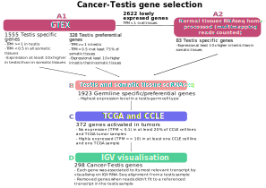

```{r style, echo = FALSE, results = 'asis'}
BiocStyle::markdown()
```

# Introduction

The CTexploreR package re-defines the list of Cancer Testis (CT) genes (also 
known a Cancer Germline genes) based on publicly available RNAseq databases 
(GTEx, CCLE and TCGA) and summarises their main characteristics. Several 
visualisation functions allow to explore their expression in different types of 
tissues and cancer cells, or to inspect the methylation status of their 
promoters in normal tissues.


**Explain why we created both (other databases that were older etc) and explain**
**difference with other databases to motivate our choice**

**Link with CTdata**


`CTdata` is the companion Package for `CTexploreR` and provides omics
data to select and characterise cancer testis genes. Data come from
public databases and include expression and methylation values of
genes in normal and tumor samples as well as in tumor cell lines, and
expression in cells treated with a demethylating agent is also
available.

The data are served through the `ExperimentHub` infrastructure, which
allows download them only ones and cache them for further
use. Currently available data are summarised in the table below and
details in the next section.

```{r data}
library("CTdata")
DT::datatable(CTdata())
```

**refer to CTdata vignette saying that if more info is needed on a dataset or how it has been created its there**


# Installation

To install the package:

```{r install1, eval = FALSE}
if (!require("BiocManager"))
    install.packages("CTexploreR")

BiocManager::install("CTexploreR")
```

To install the package from GitHub:

```{r install2, eval = FALSE}
if (!require("BiocManager"))
    install.packages("BiocManager")

BiocManager::install("UCLouvain-CBIO/CTexploreR")
```

# Available functions

For details about each data, see their respective manual pages.

**Explain a bit with examples and interp to present the use of the package and link between functions**

## CT genes determination

We datasets above, we generated a list of 307 CT genes (see figure below for 
details). 

We use multimapping because many CT genes belong to gene families from which 
members have identical or nearly identical sequences. This is likely the reason 
why these genes are not detected in GTEx database, as GTEx processing pipeline 
specifies that overlapping intervals between genes are excluded from all genes 
for counting. Some CT can thus only be detected in RNAseq data in which 
multimapping reads are not discarded.

```{r, echo=FALSE, fig.align='center', out.width = '100%'}

```


# Session information {-}

```{r sessioninfo, echo=FALSE}
sessionInfo()
```
