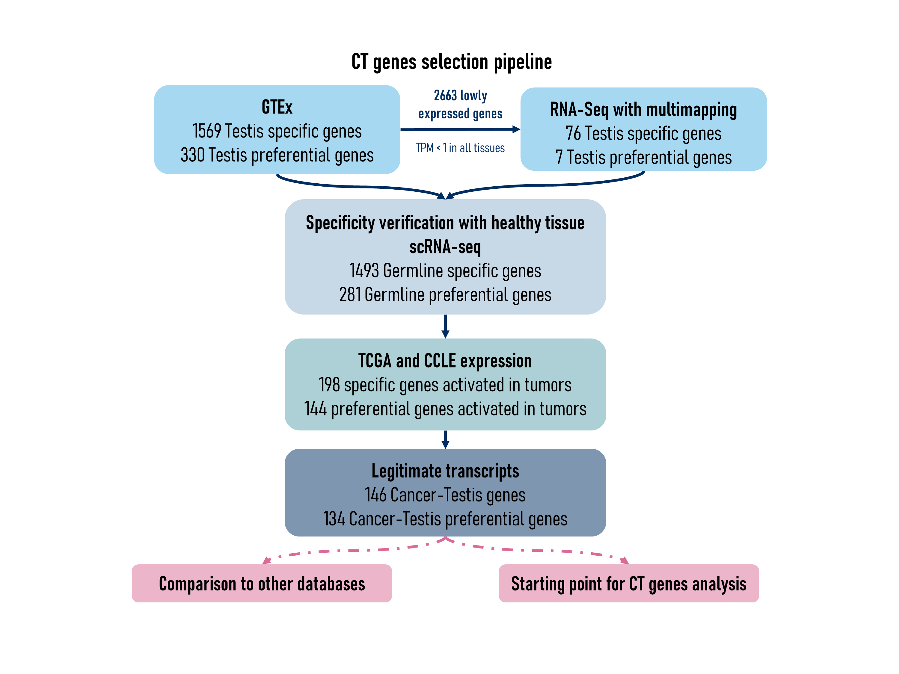

```{r style, echo = FALSE, results = 'asis'}
BiocStyle::markdown()
```

# Introduction


Cancer-Testis (CT) genes, also called Cancer-Germline (CG), are a group of genes
whose expression is normally restricted to the germline but that are found
aberrantly activated in many types of cancers. These genes produce cancer
specific antigens represent ideal targets for anti-cancer vaccines.
Besides their interest in immunotherapy, they can also be used as cancer
biomarkers and as target of anti-tumor therapies with limited side effect.

Many CT genes use DNA methylation as a primary mechanism of transcriptionnal
regulation. This is another interesting point about CT genes as they represent
suitable models to study DNA demethylation in cancer.

Currently the reference database gathering CT genes is the
[CTdatabase](http://www.cta.lncc.br/) that was published in 2009, based on a
literature screening(Almeida et al., 2009). This database is however not up to
date. Recently identified CT genes are not referenced (in particular CT genes
identified by omics methods that didn’t exist at the time) while some genes
referred as CT genes appeared to be in reality expressed in many somatic
tissues. Furthermore, the database is not in an easily importable format, some
genes are not encoded properly (by synonyms names rather than by their official
HGNC symbol names, or by a concatenation of both) resulting in poor
interoperability for downstream analyses. More recent
studies proposed other lists of CT genes like Wang’s CTatlas (Wang et al., 2016,
Jamin et al., 2021, Carter et al., 2023). These lists were established using
different criteria to define CT genes and hence differ substantially from each
other. Moreover, these lists are usually provided as supplemental data files and
are not strictly speaking databases. Finally, none of these studies describe the
involvement of DNA methylation in the regulation of individual CT genes.

We therefore created `CTexploreR`, a Bioconductor R package, aimed to redefine
rigorously the list of CT genes based on publicly available RNAseq databases
and to summarize their main characteristics. We included methylation analyses
to classify these genes according to whether they are regulated or not by DNA
methylation. The package also offers tools to visualize CT genes expression and
promoter DNA methylation in normal and tumoral tissues. CTexploreR hence
represents an up-to-date reference database for CT genes and can be used as a
starting point for further investigations related to these genes.


# Installation

To install the package:

```{r install1, eval = FALSE}
if (!require("BiocManager")) {
    install.packages("BiocManager")
}

BiocManager::install("CTexploreR")
```

To install the package from GitHub:

```{r install2, eval = FALSE}
if (!require("BiocManager")) {
    install.packages("BiocManager")
}

BiocManager::install("UCLouvain-CBIO/CTexploreR")
```

# CT genes

The central element of `CTexploreR` is the list of
`r nrow(CTexploreR::CT_genes)` CT and CTP genes (see table below) selected based
on their expression in normal and tumoral tissues (selection details in the next
section). The table also summarises their main characteristics.


```{r CT_genes}
library(CTexploreR)
head(CT_genes, 10)
```

`CTdata` is the companion Package for `CTexploreR` and provides the omics
data that was necessary to select and characterize cancer testis genes as well
as exploring them. The data are served through the `ExperimentHub` infrastructure.
Currently available data are summarised in the table below and details can be
found in `CTdata` vignette or manuals.

```{r data}
CTdata()
```

# CT gene selection

In order to generate the list of CT genes, we followed a specific
selection procedure (see figure below).

```{r ctselection, results='markup', echo=FALSE, fig.align='center', out.width = '100%'}

```

## Testis-specific expression

Testis-specific genes (expressed exclusively in testis) and testis-preferential
genes (expressed in a few somatic tissues at a level lower than 10x testis
expression) were first selected using the GTEx database (Aguet et al., 2020).

Note that some genes were undetectable in the GTEx database due to multimapping
issues (these were flagged as "lowly expressed" in `GTEX_category` column).
A careful inspection of these genes showed that many of them are well-known
Cancer-Testis genes, belonging to gene families (MAGEA, SSX, CT45A, GAGE, …)
from which members have identical or nearly identical sequences. This is likely
the reason why these genes are not detected in the GTEx database, as GTEx
processing pipeline specifies that overlapping intervals between genes are
excluded from all genes for counting.For these genes, as testis-specificity
could not be assessed using GTEx database, RNAseq data from a set of normal
tissues were reprocessed in order to allow multimapping.
Expression of several genes became detectable in some tissues. Genes showing a
testis-specific expression (expression at least 10x higher in testis than in
any somatic tissues when multimapping was allowed) were selected, and flagged
as testis-specific in `multimapping_analysis` column.


Additionally, as our selection procedure is based on bulk RNAseq data, we wanted
to ensure that the selected genes are not expressed in rare populations of 
somatic cells. We used the Single Cell Type Atlas classification from the 
Human Protein Atlas (Uhlén et al., 2015) to exclude the ones that were flagged 
as specific of any somatic cell type.


## Activation in cancer cell lines and TCGA tumors

To assess activation in cancers, RNAseq data from cancer cell lines from CCLE
(Barretina et al., 2012) and from TCGA cancer samples (Cancer Genome Atlas
Research Network et al., 2013) were used. This allowed to select among
testis-specific and testis-preferential genes those that are activated in
cancers.

In the `CCLE_category` and `TCGA_category` columns, genes are tagged as
"activated" when they are highly expressed in at one percent of cancer cell 
line/sample (TPM >= 1). However genes that were found to be expressed in all -or
almost all-cancer cell lines/samples were removed, as this probably reflects a
constitutive  expression rather than a true activation. We filtered out genes
that were not completely repressed in at least 20 % of cancer cell lines/samples
(TPM <= 0.5). We also made use of the normal peritumoral samples available in 
TCGA data to remove from our selection genes that were already detected in a 
significant fraction of these cells.


## IGV visualisation

All selected CT genes were visualised on IGV (Thorvaldsdóttir et al., 2013)
using a RNA-seq alignment from testis, to ensure that expression in testis
really corresponded to the canonical transcript. The aim was initially to 
identify precisely the transcription start site of each gene, but unexpectedly 
we observed that for some genes, the reads were not properly aligned on exons, 
but were instead spread across a wide genomic region spanning the genes. These 
genes, flagged as "unclear" in `IGV_backbone` column, were removed from the 
CT_gene category, as their expression values in GTEX, TCGA and CCLE might 
reflect a poorly defined transcription in these regions and are hence likely 
unreliable.


## Regulation by methylation

Genes flagged as `TRUE` in `regulated_by_methylation` column correspond to

* Genes that are significantly induced by a demethylating agent
  (RNAseq analysis of cell lines reated with DAC
  (5-Aza-2′-Deoxycytidine)).

* Genes that have a highly methylated promoter in normal somatic
  tissues (WGBS analysis of a set of normal tissues).

For some genes showing a strong activation in cells treated with
5-Aza-2′-Deoxycytidine, methylation analysis was not possible due to
multimapping issues. In this case, genes were still considered as regulated by
methylation unless their promoter appeared unmethylated in somatic tissues or
methylated in germ cells.


# Available functions

For details about functions, see their respective manual pages. For all
functions, an option `values_only` can  be set to `TRUE` in order to get the values
instead of the visualisation.

All visualisation functions can be used on all GTEx genes, not only
on Cancer-Testis genes, as the data they refer to contains all genes.

## Expression in normal healthy tissues

### `GTEX_expression()`

Allows to visualise gene expression in GTEx tissues. We can for example see the
difference of expression between testis-specific and testis-preferential genes.
Testis-specific genes have been determined with a stricter specificity to the
testis : they are lowly expressed in all somatic tissues and at least 10 times
more in the testis. Whereas testis-preferential accepts a little expression
outside the testis : they are lowly expressed in at least 75% of somatic
tissues, but still 10 times more in the testis.

* Applied to testis-specific genes : we can clearly see the expression strictly
limited to the testis. We can also see genes that are lowly expressed in GTEx,
and have thus been characterized using multimapping (see below).

```{r}
testis_specific <- dplyr::filter(
    CT_genes,
    CT_gene_type  == "CT_gene")
GTEX_expression(testis_specific$external_gene_name, units = "log_TPM")
```

* Applied to testis-preferential genes : we can see that the expression is
less stringent to testis, as expected, with low expression in some other
tissues, always with a strong testis signal.

```{r}
testis_preferential <- dplyr::filter(
    CT_genes, CT_gene_type  == "CTP_gene")
GTEX_expression(testis_preferential$external_gene_name, units = "log_TPM")
```

### `normal_tissue_expression_multimapping()`

Allows to visualise the expression values obtained by counting or not
multi-mapped reads in normal tissues. We can apply that to genes that are lowly
expressed in GTEx (as seen above) in order to visualise their expression.
First heatmap shows expression without multimapping while multimapping was
allowed in the second one, where expression can be observed. This allowed
their determination as testis-specific genes.

```{r}
testis_specific_in_multimapping_analysis <-
    dplyr::filter(CT_genes, lowly_expressed_in_GTEX)

normal_tissue_expression_multimapping(
    testis_specific_in_multimapping_analysis$external_gene_name,
    multimapping = FALSE, units = "log_TPM")

normal_tissue_expression_multimapping(
    testis_specific_in_multimapping_analysis$external_gene_name,
    multimapping = TRUE, units = "log_TPM")
```

### `testis_expression()`

Allows to visualise gene expression in all different testis cell type, somatic
or germ, using data from the adult human testis transcriptional cell atlas.

Using the testis cell type defined for each CT genes, we visualise clearly
that genes mainly expressed in an early stage of spermatogenesis aren't
expressed later and vice-versa.

```{r}
X_CT <-
    dplyr::filter(CT_genes, X_linked)

testis_expression(X_CT$external_gene_name,
                  cells = "germ_cells")


notX_CT <-
    dplyr::filter(CT_genes, !X_linked)

testis_expression(notX_CT$external_gene_name,
                  cells = "germ_cells")
```


### `HPA_cell_type_expression()`

Allows to visualise gene expression in all different healthy cell type,
comparing different somatic cells to germ cells, using data from the
human proteome atlas.

Visualising all CT_genes, the specificity to germ cells only is quite clear.

```{r}
HPA_cell_type_expression(units = "scaled")
```


## Expression in cancer cells and samples

### `CCLE_expression()`

Allows to visualise gene expression in different histological types of CCLE
cancer cell lines. We can thus compare genes that are or not activated in
tumoral cell lines.

* Applied to CT genes frequently activated in CCLE cell lines, more
  than 5% of CCLE cell_lines are expressing each gene. A string signal
  is visible.

```{r}
frequently_activated <- dplyr::filter(
    CT_genes,
    percent_of_positive_CCLE_cell_lines >= 5)

CCLE_expression(
    genes = frequently_activated$external_gene_name,
    type = c(
        "lung", "skin", "bile_duct", "bladder", "colorectal",
        "lymphoma", "uterine", "myeloma", "kidney",
        "pancreatic", "brain", "gastric", "breast", "bone",
        "head_and_neck", "ovarian", "sarcoma", "leukemia",
        "esophageal", "neuroblastoma"),
    units = "log_TPM")
```


* Applied to CT genes not frequently activated in CCLE cell lines,
  more than 95% of cell lines are not expressing each genes. The lack
  of expression is very clear.

```{r}
not_frequently_activated <- dplyr::filter(
    CT_genes,
    percent_of_negative_CCLE_cell_lines >= 95)

CCLE_expression(
    genes = not_frequently_activated$external_gene_name,
    type = c(
        "lung", "skin", "bile_duct", "bladder", "colorectal",
        "lymphoma", "uterine", "myeloma", "kidney",
        "pancreatic", "brain", "gastric", "breast", "bone",
        "head_and_neck", "ovarian", "sarcoma", "leukemia",
        "esophageal", "neuroblastoma"),
    units = "log_TPM")
```

### `CT_correlated_genes()`

A function that use expression data from all CCLE cell lines and returns genes
correlated (or anti-correlated) with specified CT gene.

Here with MAGEA3, we can see all genes (CT or not) whose expression is
correlated with it, like MAGEA6.


```{r}
CT_correlated_genes("MAGEA3", 0.3)
```


### `TCGA_expression()`

Allows to visualise gene expression in cancer samples from TCGA. We can thus for
example compare with activation in CCLE cell lines.

* Applied to CT genes frequently activated in CCLE cell lines

```{r}
TCGA_expression(
    genes = frequently_activated$external_gene_name,
    tumor = "all",
    units = "log_TPM")
```


* Applied to CT genes not frequently activated in CCLE cell lines

```{r}
TCGA_expression(
    genes = not_frequently_activated$external_gene_name,
    tumor = "all",
    units = "log_TPM")
```


When visualising only one tumor, there is a separation between tumoral and
peritumoral tissue.

```{r}
TCGA_expression(
    genes = frequently_activated$external_gene_name,
    tumor = "LUAD",
    units = "log_TPM")
```


## Methylation analysis

### `DAC_induction()`

Allows to visualise gene induction upon DAC treatment in a series of cell lines.
We can see the difference between CT genes regulated by methylation or not

* Applied to genes controlled by methylation

```{r}
controlled_by_methylation <- dplyr::filter(CT_genes, regulated_by_methylation)
DAC_induction(genes = controlled_by_methylation$external_gene_name)
```

* Applied to genes not controlled by methylation

```{r}
not_controlled_by_methylation <- dplyr::filter(
    CT_genes,
    !regulated_by_methylation)
DAC_induction(genes = not_controlled_by_methylation$external_gene_name)
```

### `normal_tissues_methylation()`

Gives the methylation level of all CpGs located in each promoter region
(by default defined as 1000 nt upstream TSS and 200 nt downstream TSS) in a set
of normal tissues. Can be used to analyse more precisely the methylation of a
particular promoter in normal tissues as methylation values are given CpG by
CpG.

* Applied to a gene controlled by methylation

```{r}
normal_tissues_methylation("MAGEB2")
```

* Applied to a gene not controlled by methylation

```{r}
normal_tissues_methylation("LIN28A")
```


### `normal_tissues_mean_methylation()`

Gives the mean methylation level of CpGs located in each promoter region
(by default defined as 1000 nt upstream TSS and 200 nt downstream TSS) in a set
of normal tissues. When comparing genes controlled or not by methylation, we can
see a specific methylation pattern in the first group.

* Applied to genes controlled by methylation

```{r}
normal_tissues_mean_methylation(
    genes = controlled_by_methylation$external_gene_name)
```


* Applied to genes not controlled by methylation

```{r}
normal_tissues_mean_methylation(
    genes =
        not_controlled_by_methylation$external_gene_name)
```

### `TCGA_methylation_expression_correlation()`

Shows the correlation between gene expression and promoter methylation in
TCGA samples.

* Applied to a gene controlled by methylation

```{r}
TCGA_methylation_expression_correlation(
    tumor = "all",
    gene = "TDRD1")
```

* Applied to a gene not controlled by methylation

```{r}
TCGA_methylation_expression_correlation(
    tumor = "all",
    gene = "LIN28A")
```

# Interactive heatmaps

CTexploreR's heatmaps are compatible with the `InteractiveComplexHeatmap` 
package. This allows the navigate in the last heatmap generated, search a 
specific gene as well as creating subsets to facilitate data exploration. 
More info about `InteractiveComplexHeatmap` available 
[here](https://jokergoo.github.io/InteractiveComplexHeatmap/).

```{r, eval = FALSE}
BiocManager::install("InteractiveComplexHeatmap")
library(InteractiveComplexHeatmap)

GTEX_expression(testis_specific$external_gene_name, units = "log_TPM")
htShiny()
```


# Bibliography

Aguet, F., Anand, S., Ardlie, K. G., Gabriel, S., Getz, G. A., Graubert, A.,
Hadley, K., Handsaker, R. E., Huang, K. H., Kashin, S., Li, X.,
MacArthur, D. G., Meier, S. R., Nedzel, J. L., Nguyen, D. T., Segrè, A. V.,
Todres, E., Balliu, B., Barbeira, A. N., … Volpi, S. (2020).
The GTEx Consortium atlas of genetic  regulatory effects across human tissues.
Science. https://science.sciencemag.org/content/369/6509/1318.abstract

Almeida, L. G., Sakabe, N. J., deOliveira, A. R., Silva, M. C. C., Mundstein, A.
S., Cohen, T., Chen, Y.-T., Chua, R., Gurung, S., Gnjatic, S., Jungbluth, A. A.,
Caballero, O. L., Bairoch, A., Kiesler, E., White, S. L., Simpson, A. J. G.,
Old, L. J., Camargo, A. A., & Vasconcelos, A. T. R. (2009). CTdatabase: a
knowledge-base of high-throughput and curated data on cancer-testis antigens.
Nucleic Acids Research, 37(Database issue), D816–D819.

Barretina, J., Caponigro, G., Stransky, N., Venkatesan, K., Margolin, A. A.,
Kim, S., Wilson, C. J., Lehár, J., Kryukov, G. V., Sonkin, D., Reddy, A., Liu,
M., Murray, L., Berger, M. F., Monahan, J. E., Morais, P., Meltzer, J., Korejwa,
A., Jané-Valbuena, J., … Garraway, L. A. (2012). The Cancer Cell Line
Encyclopedia enables predictive modelling of anticancer drug sensitivity.
Nature, 483(7391), 603–607.

Cancer Genome Atlas Research Network, Weinstein, J. N., Collisson, E. A., Mills,
G. B., Shaw, K. R. M., Ozenberger, B. A., Ellrott, K., Shmulevich, I., Sander,
C., & Stuart, J. M. (2013). The Cancer Genome Atlas Pan-Cancer analysis
project. Nature Genetics, 45(10), 1113–1120.

Carter, J. A., Matta, B., Battaglia, J., Somerville, C., Harris, B. D., LaPan,
M., Atwal, G. S., & Barnes, B. J. (2023). Identification of pan-cancer/testis
genes and validation of therapeutic targeting in triple-negative breast cancer:
Lin28a- and Siglece-based vaccination induces anti-tumor immunity and inhibits
metastasis. In bioRxiv (p. 2023.05.09.539617).

Guo, J. et al. The adult human testis transcriptional cell atlas. Cell Res. 28,
1141–1157 (2018).

Uhlén, M. et al. Proteomics. Tissue-based map of the human proteome. Science
347, 1260419 (2015).

Thorvaldsdóttir, H., Robinson, J. T., & Mesirov, J. P. (2013). Integrative
Genomics Viewer (IGV): high-performance genomics data visualization and
exploration. Briefings in Bioinformatics, 14(2), 178–192.

Wang, C., Gu, Y., Zhang, K., Xie, K., Zhu, M., Dai, N., Jiang, Y., Guo, X., Liu,
M., Dai, J., Wu, L., Jin, G., Ma, H., Jiang, T., Yin, R., Xia, Y., Liu, L.,
Wang, S., Shen, B., … Hu, Z. (2016). Systematic identification of genes with a
cancer-testis expression pattern in 19 cancer types. Nature Communications, 7,
10499.

# Session information {-}

```{r sessioninfo, echo=FALSE}
sessionInfo()
```
